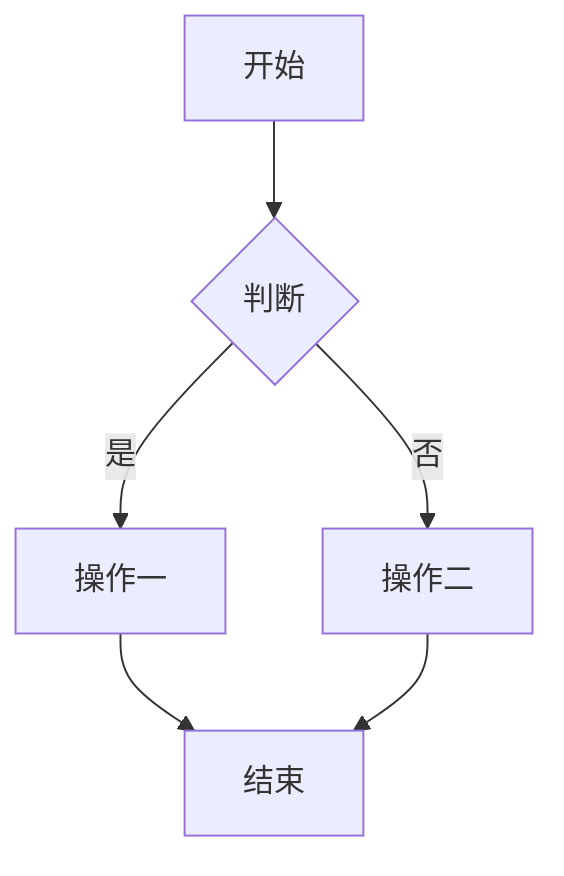
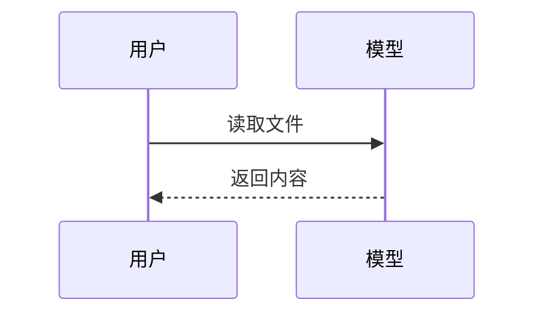
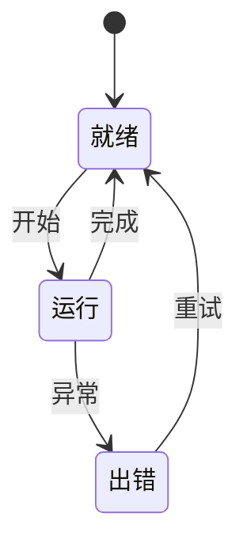

# Mermaid 渲染验证

> 阅读模式（.md 顶部点「阅读」）下打开本文件，确认 mermaid 是否被渲染。

## 流程图

```mermaid
graph TD
  A[开始] --> B{判断}
  B -->|是| C[操作一]
  B -->|否| D[操作二]
  C --> E[结束]
  D --> E
```

## 时序图

```mermaid
sequenceDiagram
  participant A as 用户
  participant B as 模型
  A->>B: 读取文件
  B-->>A: 返回内容
```

## 状态图

```mermaid
stateDiagram-v2
  [*] --> 就绪
  就绪 --> 运行: 开始
  运行 --> 就绪: 完成
  运行 --> 出错: 异常
  出错 --> 就绪: 重试
```
